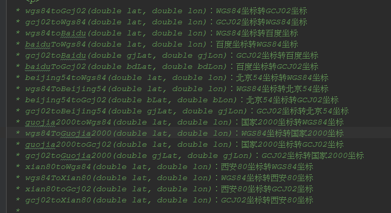
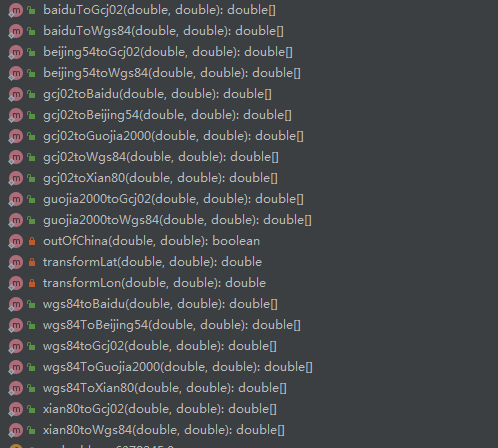

# 经纬度坐标系转换算法

#### 介绍
北京54，国家2000，西安80，gcj02，百度坐标，wgs84坐标， 互相转换的方法，使用java语言

### 目前实现方法
 * wgs84toGcj02(double lat, double lon)：WGS84坐标转GCJ02坐标
 * gcj02toWgs84(double lat, double lon)：GCJ02坐标转WGS84坐标
 * wgs84toBaidu(double lat, double lon)：WGS84坐标转百度坐标
 * baiduToWgs84(double lat, double lon)：百度坐标转WGS84坐标
 * gcj02toBaidu(double gjLat, double gjLon)：GCJ02坐标转百度坐标
 * baiduToGcj02(double bdLat, double bdLon)：百度坐标转GCJ02坐标
 * beijing54toWgs84(double lat, double lon)：北京54坐标转WGS84坐标
 * wgs84ToBeijing54(double lat, double lon)：WGS84坐标转北京54坐标
 * beijing54toGcj02(double bLat, double bLon)：北京54坐标转GCJ02坐标
 * gcj02toBeijing54(double gjLat, double gjLon)：GCJ02坐标转北京54坐标
 * guojia2000toWgs84(double lat, double lon)：国家2000坐标转WGS84坐标
 * wgs84ToGuojia2000(double lat, double lon)：WGS84坐标转国家2000坐标
 * guojia2000toGcj02(double lat, double lon)：国家2000坐标转GCJ02坐标
 * gcj02toGuojia2000(double gjLat, double gjLon)：GCJ02坐标转国家2000坐标
 * xian80toWgs84(double lat, double lon)：西安80坐标转WGS84坐标
 * wgs84ToXian80(double lat, double lon)：WGS84坐标转西安80坐标
 * xian80toGcj02(double lat, double lon)：西安80坐标转GCJ02坐标
 * gcj02toXian80(double lat, double lon)：GCJ02坐标转西安80坐标
 *

使用方法
gcj02ToWgs84(114.298859,22.688766)
========>

原始坐标:114.298859,22.688766
WGS84坐标为：114.29401047169331,22.69156588613905

#### 演示图
演示图

### 需要代码的可以加我的QQ：873015763
可以交付代码以及远程安装运行成功